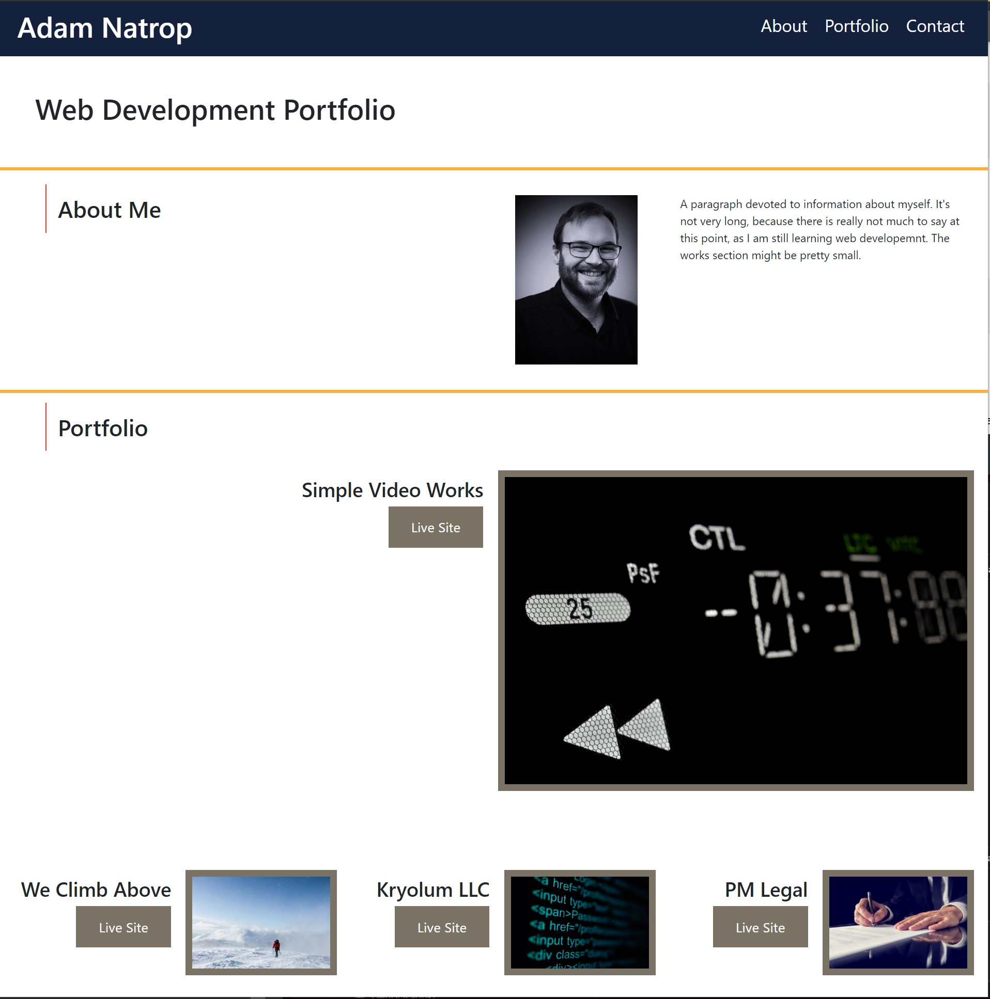
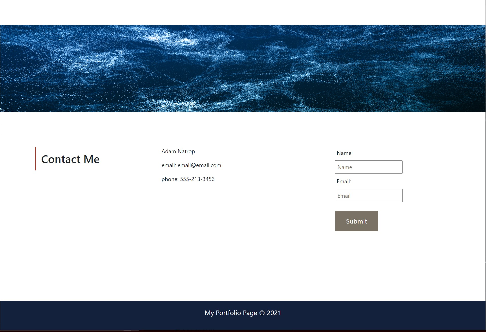

# css_portfolio

First web development portfolio with an about me, my work examples, and a contact section. Layout was done with bootstrap grid. The instructor Gary gave permission to use bootstrap. All links are fucntional as well as have hover effects. Links to websites are sites I have built on other platforms, such as squarespace. 

The layout and color pallet need work and the overall page needs more fine tuning to tighten items up in the layout. Site is responsive for mobile and tablet devices. Nav links scroll to each section. 

## Links to live site and repo:

### GitHub
https://github.com/adamnatrop/css_portfolio

### Live Site
https://adamnatrop.github.io/css_portfolio/

## Screenshots

